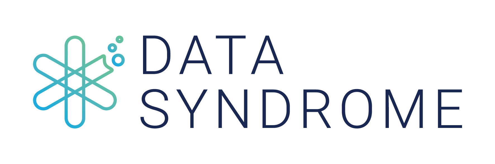

# Open Business Graph

The Open Business Graph is an effort to create an open graph describing the business world, accepting contributions from a crowd. This includes connections between companies and individuals. Some examples of types of connections between companies include partnerships, competitors, customers and investors; between people and companies - employee, investor, owner, partner and advisor. And everyone is familiar with connections between people on social networks.

## Data Syndrome



Data Syndrome is available to help you work with this dataset. Check out our [website](http://datasyndrome.com) and get in touch!

## Working with the Graph

The graph is provided as a JSON dump of the edges and nodes tables. You can use any graph database or library to analyze this data, and at the moment we include code and instructions for Titan. 

To play with the Open Business Graph using Titan, you need to load the MongoDB dump, then create a Titan DB using Gremlin and a setup script. 

## Creating the Titan Database

Then run the script in `setup.groovy`, which sets up the titan schema and loads the records from Mongo. After that, you're ready to load the data into our Titan DB.

## Loading data into Titan

Check out the `titan/read_json_load_titan.groovy` file, which does things like:

```groovy
while((json = company_reader.readLine()) != null)
{
  document = jsonSlurper.parseText(json)
  
  v = graph.addVertex('company')
  v.property("_id", document._id.$oid) 
  v.property("udpate_time", document.update_time.$date) 
  v.property("domain", document.domain)
  v.property("name", document.name)
}
```

and:

```groovy
while((json = links_reader.readLine()) != null)
{
  document = jsonSlurper.parseText(json)
  
  // Add edges to graph
  v1 = g.V().has('domain', document.home_domain).next()
  v2 = g.V().has('domain', document.link_domain).next()
  
  v1.addEdge(document.type, v2, 'update_time', document.update_time.$date)
}
```

## Querying the Data

To initialize a session, use the script `titan/startup.groovy`, which does this:


```groovy
// Use this to start up a session
conf = new BaseConfiguration()
conf.setProperty("storage.directory", "/Users/rjurney/Software/marketing/titan/data")
conf.setProperty("storage.backend", "berkeleyje")
graph = TitanFactory.open(conf)

// Get a graph traverser
g = graph.traversal()
```